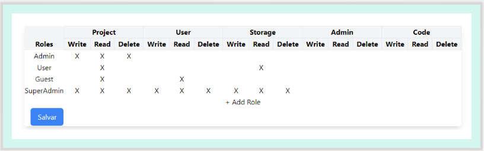

# Resolución de Prueba Técnica de Desarrollo FrontEnd | Demo (https://tecnonew365.github.io/roles-permissions-challenge/)

## Enunciado de la prueba técnica 

Requerimientos tecnológicos: ReacjJS, Javascript, CSS, html5. Subir la solución a un repositorio en Github.

Implementar un componente en ReactJS que permita la gestión de roles y permisos.
El componente recibirá dos arreglos: un arreglo de objetos con los roles y otro arreglo de strings con los posibles permisos.

Un Rol es un documento que contiene los siguientes campos:
 - id: Cadena de alfanuméricos compatible con un identificador de MongoDB.
 - name: nombre del rol.
 - permissions: arreglo de strings que contiene todos los permisos asociados al rol en cuestión.
Los permisos son cadenas de caracteres que contienen solamente letras mayúsculas, el carácter de subrayado (‘_’) y el carácter para los dos puntos (‘:’). La estructura de la cadena sería la siguiente: `${ENTITY}:${PERMISSION}` donde, ENTITY representa el nombre de la entidad a la que se le está solicitando el permiso y PERMISSION es el permiso que se está solicitando. Tanto ENTITY como PERMISSION están compuesto solamente por letras mayúsculas, en caso que se quiera utilizar varias palabras para representar los nombres, las mismas se separarán utilizando el carácter de subrayado. Ejemplos de permisos:
 - PROJECT:WRITE
 - STORE:READ
 - ACCOUNT:READ_ACCESS
Para representar visualmente la asociación de roles y permisos se utilizará una tabla donde:
 - La primera fila será para el nombre del rol.
 - El encabezado de la primera columna será “Roles”
 - Cada columna representará un permiso en particular.
 - Todos los permisos asociados a una misma entidad aparecerán consecutivos.
 - El encabezado de todas las columnas de permisos estará compuesto por dos filas, la primera tiene el nombre de la entidad, la segunda el nombre del permiso.
 - Cuando se hace un mouseover sobre el nombre del rol aparecerá en frente del mismo un checkbox que dará la posibilidad de asignar o quitar todos los permisos al mismo tiempo.
 - Cuando se hace un mouseover sobre el nombre de una entidad aparecerá un checkbox que dará la posibilidad de asignar o quitar todos los permisos asociados a ella a todos los roles.
 - Cuando se hace mouseover sobre el nombre de un permiso, aparecerá en frente del mismo un checkbox que dará la posibilidad de asignar o quitar dicho permiso a todos los roles.
 - Cuando se hace un mouseover sobre el nombre del rol aparecerá en el extremo derecho de la celda un latón o ícono de eliminación que permitirá borrar el rol.
 - Cuando se hace un mouseover sobre el nombre de una entidad aparecerá en el extremo derecho de la celda un latón o ícono de eliminación que permitirá borrar todos los permisos asociados a esa entidad.
 - Cuando se hace mouseover sobre el nombre de un permiso aparecerá en el extremo derecho de la celda un latón o ícono de eliminación que permitirá borrar el permiso.
 - Cada celda de la tabla que no sea encabezado contendrá una X si el rol de la fila tiene asignado el permiso que representa la columna, en caso contrario aparecerá en blanco.
 - La última fila de la tabla permitirá la adición de un nuevo rol (funciona como un input). El rol adicionado tendrá por defecto asignados todos los permisos que contengan la palabra READ en su nombre.
 - La última columna de la tabla permitirá la adición de un nuevo permiso (funciona como botón, al presionarlo aparecerá un modal con un input y un botón de “Ok” para introducir el nuevo permiso). El permiso deberá ser introducido con la sintaxis descrita al comienzo del documento. Se deberá validar si la cadena que se está introduciendo es un permiso válido (ej: “USER:READ” es válido, “USER:READ-ALL” no es un permiso válido). Al presionarse el botón Ok, si la entidad asociada al permiso ya existe, el permiso se pone como una columna más bajo esa entidad. En caso de no existir la entidad, se adicionaría al final de la tabla como una nueva entidad con un nuevo permiso.
 - Si la tabla no es visible completamente en la pantalla aparecerán barras de scroll vertical y horizontal, según se necesiten. Las barras permitirán desplazarse en ambos sentidos dejando fijas la primera columna y las filas de encabezado.
 - Los nombres de las entidades y los permisos se representan visualmente capitalizando la primera letra y el resto en minúsculas. En caso de aparecer el carácter de subrayado se sustituye por un espacio en blanco.

El componente contendrá además un botón de Salvar (Save). Al presionar dicho botón se devolverá un arreglo con los roles y sus permisos actualizados (con la misma estructura que el arreglo de roles que se pasa como parámetros).

Para la integración, asuma que se comunica con una API (utilizar una variable de entorno para establecer la URL de la API) que tiene los siguientes endpoints:
 - POST /api/roles : envía como payload un arreglo de roles para su creación. La estructura de un rol es la misma descrita al comienzo del enunciado.
 - PUT /api/roles : envía como payload un arreglo de roles para su actualización. La estructura de un rol es la misma descrita al comienzo del enunciado.
 - DELETE /api/roles : envía como payload un arreglo de IDs (strings) para la eliminación de los roles.

## Estructura de Carpetas

- src/: Contiene el código fuente de la aplicación React.js
- public/: Contiene archivos estáticos como el punto de entrada index.html
- tailwind.config.js: Archivo de configuración de Tailwind CSS
- README.md: Este archivo que contiene la documentación de la resolución de la prueba técnica

## Instrucciones de Ejecución

Para ejecutar la solución de la prueba técnica, sigue los siguientes pasos:
1. Clona este repositorio en tu máquina local.
2. Abre una terminal y navega hasta la carpeta raíz del proyecto.
3. Ejecuta el siguiente comando para usar la version de Node que se encuentra en .nvmrc
    ```bash
    nvm use
    ```
4. Ejecuta el siguiente comando para instalar las dependencias del proyecto:
   ```bash
   npm install
   ```
5. Luego, puedes iniciar la aplicación utilizando el siguiente comando:
   ```bash
   npm start
   ```
6. Abre tu navegador web y visita http://localhost:5137 para ver la aplicación en funcionamiento.

## Capturas de Pantalla



## Recursos Adicionales

- Documentación de React.js (https://es.react.dev/learn)
- Documentación de Tailwind CSS (https://tailwindcss.com/docs)
- Documentación de Vite (https://es.vitejs.dev/guide)

¡Gracias por revisar la solución de la prueba técnica!
